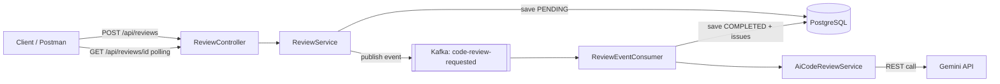

# ScrutinyAI

AI-powered code review tool. Paste a code snippet and get a quality score, a list of issues, natural-language explanations, automated fix suggestions, and generated JUnit tests.

## Features

- JWT-based authentication (register/login)
- Synchronous review submission processed asynchronously via Kafka
- Per-issue AI interactions: explain, fix, generate tests
- Review history with pagination and language filtering
- OpenAPI/Swagger documentation

## Tech Stack

| Layer | Technology |
|---|---|
| Language | Java 25 |
| Framework | Spring Boot 4.1.1 |
| Database | PostgreSQL |
| Migrations | Flyway |
| Security | Spring Security + JWT |
| AI Integration | WebClient (raw REST) to Gemini |
| Async Processing | Apache Kafka (KRaft mode) |
| Documentation | Springdoc OpenAPI (Swagger) |
| Containerization | Docker + Docker Compose |

## Architecture

## Setup

### Prerequisites

- Docker and Docker Compose
- A Gemini API key

### Environment Variables

Copy `.env.example` to `.env` and fill in your own values:

DB_PASSWORD=your_postgres_password
JWT_SECRET=your_jwt_secret_key
AI_API_KEY=your_gemini_api_key

### Run

docker compose up --build

The application starts at `http://localhost:8080`. API documentation is available at `http://localhost:8080/swagger-ui.html`.

### API Overview

| Method | Endpoint | Description |
|---|---|---|
| POST | `/api/auth/register` | Register a new user |
| POST | `/api/auth/login` | Log in and receive a JWT |
| POST | `/api/reviews` | Submit code for review (async) |
| GET | `/api/reviews/{id}` | Get a review by id |
| GET | `/api/reviews` | List reviews (paginated, filterable by language) |
| POST | `/api/reviews/{reviewId}/issues/{issueId}/explain` | Get an AI explanation for an issue |
| POST | `/api/reviews/{reviewId}/issues/{issueId}/fix` | Get an AI-suggested fix for an issue |
| POST | `/api/reviews/{reviewId}/generate-tests` | Generate JUnit tests for a review |

## Screenshots

_Coming soon 

## Roadmap

- [x] Faz 1 — Core setup and synchronous review
- [x] Faz 2 — Issue-based AI features (explain, fix, generate tests)
- [x] Faz 3 — Async processing with Kafka
- [x] Faz 4 — Quality and polish (authorization, pagination, tests, Swagger, Docker)
- [ ] Faz 5 — Frontend (React + Monaco Editor)