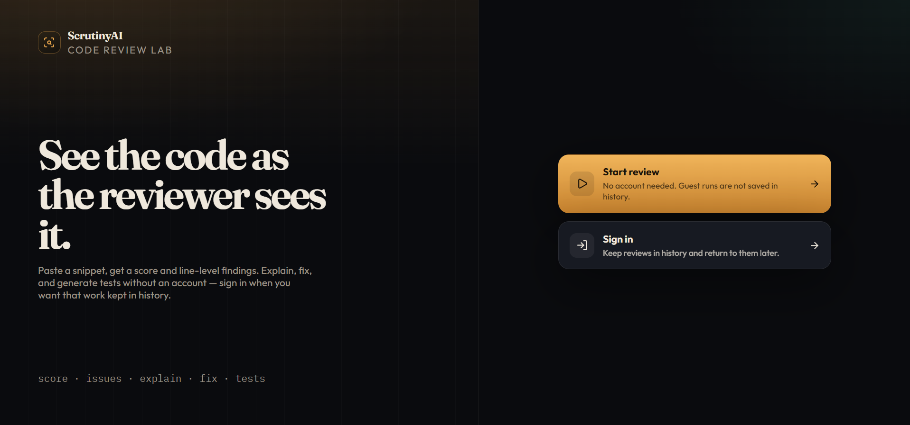
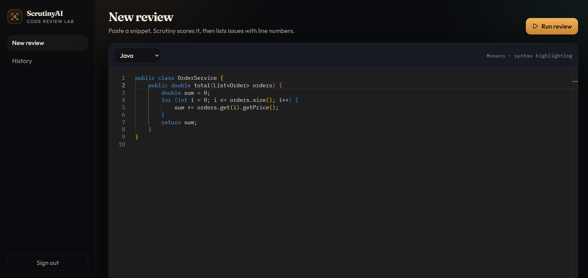
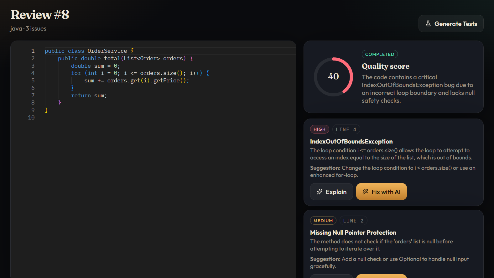
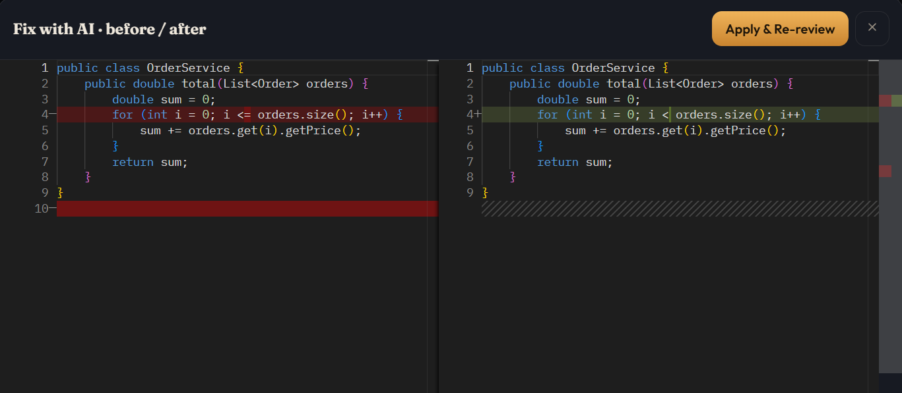
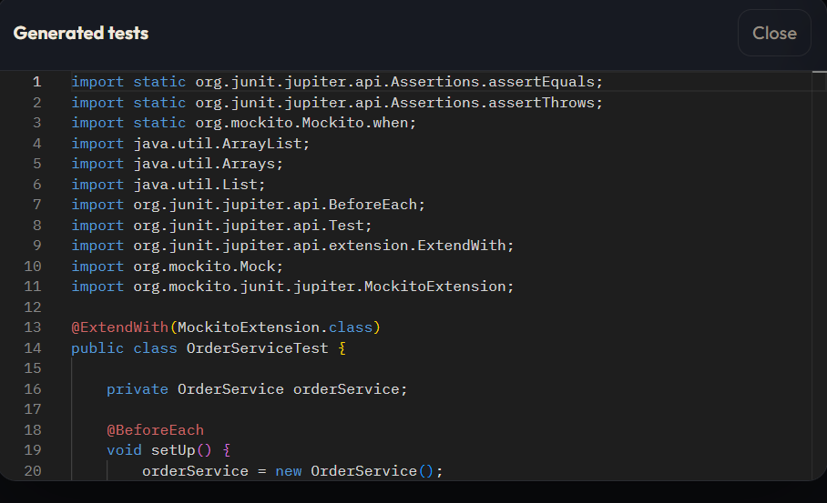
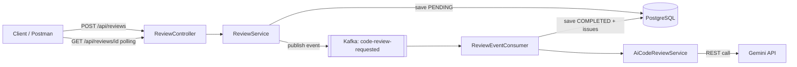

# ScrutinyAI

AI-powered code review tool. Paste a code snippet and get a quality score, a list of issues, natural-language explanations, automated fix suggestions, and generated JUnit tests.

## Live Demo

[https://scrutiny-ai-five.vercel.app/](https://scrutiny-ai-five.vercel.app/)

> The backend runs on Render's free tier and spins down after periods of inactivity. The first request may take a couple of minutes while it wakes up — subsequent requests are fast.

## Features

- JWT-based authentication (register/login)
- Synchronous review submission processed asynchronously via Kafka
- Per-issue AI interactions: explain, fix, generate tests
- Review history with pagination and language filtering
- OpenAPI/Swagger documentation

## Screenshots

### Home page



### Guest code review



### Review result



### Fix with AI



### Explain issue & Generate tests

<table>
  <tr>
    <td></td>
    <td></td>
  </tr>
</table>

## Tech Stack

| Layer | Technology |
|---|---|
| Language | Java 25 |
| Framework | Spring Boot 4.1.1 |
| Database | PostgreSQL |
| Migrations | Flyway |
| Security | Spring Security + JWT |
| AI Integration | WebClient (raw REST) to Gemini |
| Async Processing | Apache Kafka (KRaft mode) |
| Documentation | Springdoc OpenAPI (Swagger) |
| Containerization | Docker + Docker Compose |

## Architecture



## Setup

### Prerequisites

- Docker and Docker Compose
- A Gemini API key

### Environment Variables

Copy `.env.example` to `.env` and fill in your own values.

| Variable | Required | Description |
|---|---|---|
| `DB_PASSWORD` | Yes | PostgreSQL password (used by both `postgres` and `app` services in Docker Compose) |
| `JWT_SECRET` | Yes | Secret key used to sign JWTs |
| `AI_API_KEY` | Yes | Gemini API key |
| `DB_URL` | No | Overrides the datasource URL (defaults to the local Docker Postgres) — used for cloud deployments |
| `DB_USERNAME` | No | Overrides the datasource username (defaults to `postgres`) |
| `KAFKA_BOOTSTRAP_SERVERS` | No | Overrides Kafka bootstrap servers (defaults to local Docker Kafka) — used for cloud deployments |
| `KAFKA_SECURITY_PROTOCOL` | No | Kafka security protocol, e.g. `SASL_SSL` for managed cloud Kafka |
| `KAFKA_SASL_MECHANISM` | No | SASL mechanism, e.g. `SCRAM-SHA-256` |
| `KAFKA_SASL_JAAS_CONFIG` | No | SASL JAAS config string (contains Kafka username/password) |
| `KAFKA_TRUSTSTORE_LOCATION` | No | Path to the Kafka SSL truststore |
| `KAFKA_TRUSTSTORE_PASSWORD` | No | Password for the Kafka SSL truststore |

```
DB_PASSWORD=your_postgres_password
JWT_SECRET=your_jwt_secret_key
AI_API_KEY=your_gemini_api_key
```

### Run

```bash
docker compose up --build
```

The application starts at `http://localhost:8080`. API documentation is available at `http://localhost:8080/swagger-ui.html`.

### Frontend

The React + Monaco demo lives in `frontend/`. With the API running:

```bash
cd frontend
npm install
npm run dev
```

Open `http://localhost:5173`. Vite proxies `/api` to `http://localhost:8080` by default.

To point the frontend at a different backend (e.g. a deployed instance), set `VITE_API_URL` in `frontend/.env`.

### API Overview

| Method | Endpoint | Description |
|---|---|---|
| POST | `/api/auth/register` | Register a new user |
| POST | `/api/auth/login` | Log in and receive a JWT |
| POST | `/api/reviews` | Submit code for review. Guests get a synchronous result (not persisted). Signed-in users get async processing + history. |
| GET | `/api/reviews/{id}` | Get a saved review by id (authenticated) |
| GET | `/api/reviews` | List reviews (paginated, filterable by language; authenticated) |
| POST | `/api/reviews/{reviewId}/issues/{issueId}/explain` | Explain an issue on a saved review (authenticated) |
| POST | `/api/reviews/{reviewId}/issues/{issueId}/fix` | Suggest a fix for a saved issue (authenticated) |
| POST | `/api/reviews/{reviewId}/generate-tests` | Generate tests for a saved review (authenticated) |
| POST | `/api/guest/explain` | Explain an issue without persisting (public) |
| POST | `/api/guest/fix` | Suggest a fix without persisting (public) |
| POST | `/api/guest/generate-tests` | Generate tests without persisting (public) |